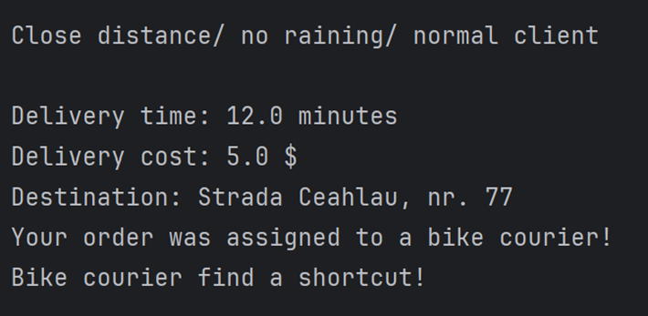
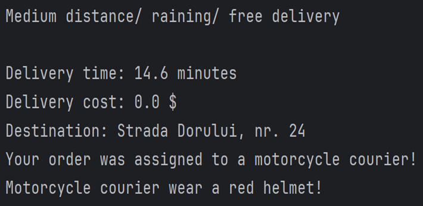
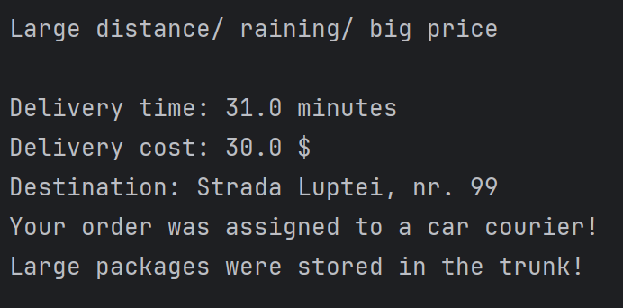

# Delivery Management System
## Homework 2 (Design Patterns)

De când sunt student la Cluj am început să folosesc foarte mult serviciul de delivery, atât din comoditate, cât și din ușurința cu care mâncarea ajunge la mine la ușă. Cu toate acestea, am observat cât de dinamic fluctuează prețul la livrare și astfel mi-a venit ideea să implementez un program în Java care să facă managementul unei firme de delivery.

Am ales două design pattern-uri diferite pentru a structura acest proiect:

### 1. Factory Method (Creational)

Prima dată am utilizat Factory Method. Utilizând acest design pattern am reușit să obțin un cod extrem de bine structurat și curat. O firmă de delivery are de obicei mai mulți curieri, iar fiecare se poate deplasa folosind diferite tipuri de vehicule (Bicicletă, Motocicletă sau Mașină). În mod normal, ar fi trebuit să creez manual instanțe pentru fiecare fel de curier, legând codul de implementări specifice. Factory rezolvă asta, bazându-se pe folosirea unei interfețe (Courier) în care am definit 3 metode implementate în toate cele 3 clase derivate (BikeCourier, MotorcycleCourier și CarCourier).

Cele 3 metode oferă o implementare pentru următoarele aspecte:
1. void deliverOrder(String destination) - mă ajută să știu unde trebuie făcută livrarea.
2. double calculateDeliveryTime(double distance) - mă ajută să calculez timpul estimat în funcție de distanța cursei.
3. double getBaseCost() - un simplu getter care îmi returnează prețul de bază al fiecărui tip de curier (BikeCourier – 5, MotorcycleCourier – 10, CarCourier – 15).

În plus, fiecare clasă are și o metodă privată individuală, pe care am folosit-o pentru a afișa informații relevante despre livrare (ex. tip curier, scurtătură traseu, loc de depozitare generos).

Mai mult, fiecare clasă conține și un atribut pentru viteza (speedPerKm) curierului, astfel putând să calculez timpul estimat de livrare utilizând următoarea formulă:
estimatedTime = (distance / speedPerKm) * 60 (min)

Aici am considerat că un curier cu mașina va sta cel mai mult blocat în trafic, motiv pentru care i-am adăugat o marjă de eroare de +10 minute, iar la cel care utilizează motocicleta i-am adăugat o marjă de +5 minute. Curierul care se deplasează utilizând bicicleta este cel mai avantajat, nu stă în trafic și o poate lua pe scurtături pentru a livra comanda, deci timpul estimat este adeseori cel real.

### 2. Strategy Pattern (Behavioral)

Apoi, am folosit Strategy Pattern. Motivul principal pentru care am ales acest pattern este acela că logica de preț se schimbă constant. Dacă aș fi implementat strategiile de taxare direct în clasa principală, codul ar fi devenit extrem de încărcat, plin de structuri condiționale (if/else) greu de întreținut. Strategy rezolvă exact această problemă: decuplează algoritmul de calcul de restul aplicației. Astfel, în momentul în care creez o comandă, aplic dinamic o strategie de taxare.

Am pornit de la interfața BillingStrategy, unde am declarat metoda de calcul final al prețului (calculateFinalPrice()). Apoi, asemănător cu prima parte a problemei, am creat trei clase diferite, interschimbabile la rulare, pentru diverse tipuri de taxare:
* StandardStrategy - preț standard de livrare.
* FreeStrategy - utilizată dacă clientul are livrare gratuită.
* SuperStrategy - aplică o supra-taxă în funcție de vreme rea sau distanță lungă.

### Simularea Proiectului

În final, am făcut o simulare a proiectului în clasa DeliveryManager. Aici am creat 3 comenzi diferite folosind atribute precum distance (double) și isRaining (boolean), tocmai pentru a simula situații diverse din viața reală. 

Prin Factory se alege tipul de curier potrivit, iar prin Strategy se aplică taxa corectă. De asemenea, am creat metoda statică processOrder(), în care verific existența unui curier alocat, preiau costul de bază, aplic strategia pentru prețul final, calculez timpul estimat și afișez toate aceste aspecte pentru client.

**Scenariul 1: Bicicletă (Distanță scurtă / vreme bună)**

**Scenariul 2: Motocicletă (Distanță medie / ploaie)**

**Scenariul 3: Mașină (Distanță mare / ploaie)**

